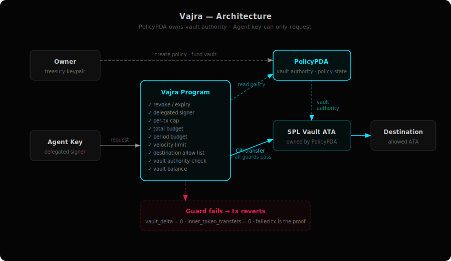
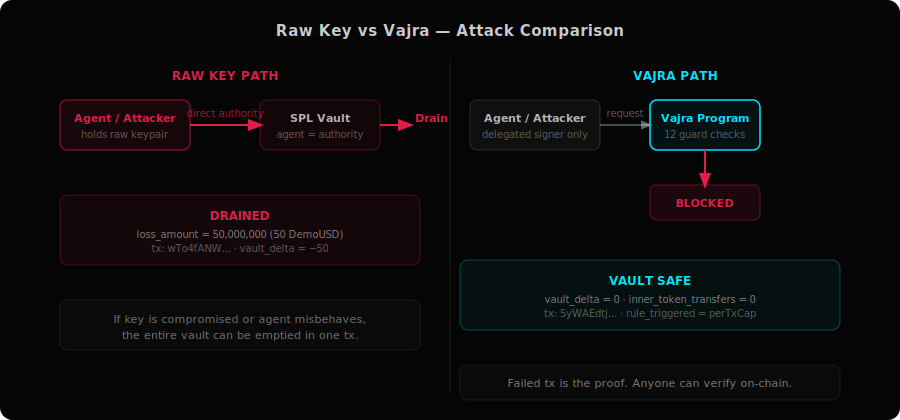
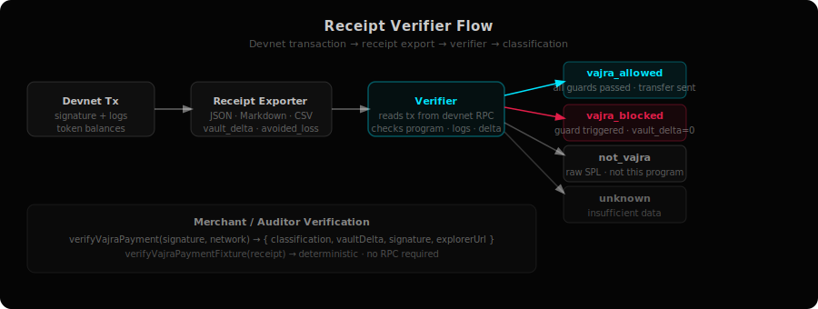

# Vajra

**Non-custodial SPL allowance vault for Solana automated signers.**

The agent key never holds vault authority. The agent requests; the Vajra program enforces; the PolicyPDA signs the SPL transfer only if every policy check passes.

[](https://usevajra.xyz)
[](https://www.npmjs.com/package/@vinaystwt/vajra-sdk)
[](https://www.npmjs.com/package/@vinaystwt/vajra-mcp)
[](https://explorer.solana.com/address/APn6AN7FphYAjUEJWhvGZa1T5nfQDNmCcFW2244p4UoD?cluster=devnet)
[](LICENSE)

---

## The Problem

Automated signers — trading bots, payment agents, DAO ops accounts, rebalancers — need to spend SOL and tokens. The simplest approach is to give the agent keypair direct authority over the treasury. That creates drain risk:

- Key leaks → full treasury gone in one transaction
- Agent bug → unintended spend with no enforcement boundary
- Backend allowlists → bypassable by anyone with the key

The enforcement boundary needs to live on-chain, not in your backend.

---

## The Solution

Vajra places a **PolicyPDA** between the agent and the vault. The PolicyPDA owns the SPL vault ATA and is the only account that can sign a CPI token transfer. The agent key is a delegated signer; it can *request* a transfer but cannot *authorize* one directly.

When the agent calls `execute_guarded_transfer`, the program checks:

| Guard | Description |
|---|---|
| revoke | Policy has not been revoked by owner |
| expiry | Policy has not expired |
| delegated signer | Caller matches the registered agent key |
| amount > 0 | Non-zero transfer requested |
| per-tx cap | Single transfer ≤ `per_tx_cap` |
| total budget | Cumulative spend ≤ `total_budget` |
| periodic budget | Spend in current period ≤ `period_budget` |
| velocity limit | Transfers per minute ≤ `velocity_limit` |
| destination rule | Destination is on the allow list |
| destination mint | Destination mint matches policy mint |
| vault mint | Vault mint matches policy mint |
| vault authority | Vault is owned by this PolicyPDA |
| vault balance | Vault has sufficient balance |

If every guard passes, the program CPIs the SPL token transfer using the PolicyPDA's signer seeds. If any guard fails, the transaction reverts — **vault delta stays zero**.

---

## Core Proof

The following devnet transactions are publicly verifiable.

### Raw key drain (no Vajra)
The agent holds direct vault authority. Transfer succeeds immediately.

| Field | Value |
|---|---|
| Signature | [`wTo4fANW...`](https://explorer.solana.com/tx/wTo4fANWAG6P3azWJ4W3MQVYn5rYpZp6s3ZijsKsN4xGP2ACCGieZgtYKXZ6wiFNW3WTek9Paeco9bozGye95p3?cluster=devnet) |
| Result | drained |
| Loss | 50,000,000 (50 DemoUSD units) |
| Classification | `not_vajra` |

### Vajra blocked drain
The same attacker requests a transfer exceeding the per-tx cap. The program reverts.

| Field | Value |
|---|---|
| Signature | [`5yWAEdtj...`](https://explorer.solana.com/tx/5yWAEdtjihJjGWk9phXLvAG831r9yqvT7qrPgbmaFXoS5whsFSLLuuLLFGnUmKpAE22RWvFxPk3NDn1oCqfEqEf8?cluster=devnet) |
| Rule triggered | `perTxCap` |
| vault\_delta | 0 |
| inner\_token\_transfers | 0 |
| Classification | `vajra_blocked` |

### Allowed payment
A valid payment within policy limits succeeds.

| Field | Value |
|---|---|
| Signature | [`24SD6Cdp...`](https://explorer.solana.com/tx/24SD6CdpkJqJj5EHW2cMULVoXU5qwURrgohidQ25jhLPLYHSgANCnxbaAdZhPzREsLJni7g4bu6XR9tNsuEAfREL?cluster=devnet) |
| Result | allowed |
| Classification | `vajra_allowed` |

Full proof artifacts: `proofs/devnet-signatures.json`, `proofs/latest/red-team-comparison.json`

---

## Architecture



**Core accounts:**

- `PolicyPDA` — vault authority, policy state (budget, cap, velocity, expiry, revoke, allowlist)
- `Vault ATA` — SPL token account whose authority is the PolicyPDA
- `DestinationRulePDA` — allow list record for each permitted destination

---

## Attack Comparison



---

## Receipt Verifier



---

## Features

- PolicyPDA-owned SPL vault — agent key has zero vault authority
- Per-transaction cap
- Total budget enforcement
- Periodic (rolling window) budget
- Velocity limiting (transfers/minute)
- Destination allow list
- Policy expiry
- Owner revoke
- Owner withdrawal and recovery
- Deterministic JSON/Markdown/CSV receipts
- Merchant payment verification (`vajra_allowed` / `vajra_blocked` / `not_vajra`)
- Red-team proof sandbox (compare raw-key drain vs. Vajra block)
- Agent mandate system (human-readable allowance specifications)
- TypeScript SDK (`@vinaystwt/vajra-sdk`)
- MCP server (`@vinaystwt/vajra-mcp`)
- Local HTTP 402-style reference integration (`examples/x402-vajra`)
- Frontend: Attack Lab, Proof Explorer, Developer simulator

---

## SDK

```bash
npm install @vinaystwt/vajra-sdk
```

```typescript
import { VajraClient, getMandate, mandateToPolicyConfig } from "@vinaystwt/vajra-sdk";

const client = new VajraClient({ rpc: "https://api.devnet.solana.com" });

// Use a pre-built mandate
const mandate = getMandate("stablecoin-agent");
const policyConfig = mandateToPolicyConfig(mandate!);

// Simulate before spending
const sim = await client.simulateSpend({
  policy: policyAddress,
  amount: BigInt(100_000_000),
  destination: destAta,
});

if (sim.allowed) {
  await client.spend({ policy: policyAddress, amount: BigInt(100_000_000), destination: destAta, signer: agentWallet });
}
```

See [`SDK.md`](SDK.md) and [`packages/sdk/README.md`](packages/sdk/README.md).

---

## MCP Server

```bash
npx @vinaystwt/vajra-mcp
```

Exposes tools for: simulate spend, execute spend, list mandates, verify receipts, export proof artifacts, and red-team sandbox fixtures. Compatible with any MCP-capable agent framework.

See [`MCP.md`](MCP.md).

---

## Local Development

```bash
# Install dependencies
npm install

# Build Anchor program
anchor build

# Run Rust tests (32 tests via litesvm)
cargo test --manifest-path programs/vajra/Cargo.toml

# Build TypeScript
npm run build

# Build frontend
cd app && npm run build

# Run devnet demo
npm run devnet:demo

# Export proof artifacts
npm run proof:latest
```

---

## Testing

| Suite | Command | Coverage |
|---|---|---|
| Rust / litesvm | `cargo test --manifest-path programs/vajra/Cargo.toml` | 32 tests, all guards |
| SDK | `cd packages/sdk && npm run build && npm test` | mandate, receipt, verifier |
| MCP | `cd packages/mcp && npm run build && npm test` | tool smoke tests |
| Frontend build | `cd app && npm run build` | TypeScript + Vite |
| Proof verification | `npm run verify:fixtures` | receipt determinism |
| Red-team sandbox | `npm run demo:red-team` | drain vs. block comparison |

---

## Devnet Proof Artifacts

**Program:** `APn6AN7FphYAjUEJWhvGZa1T5nfQDNmCcFW2244p4UoD`

[View on Explorer →](https://explorer.solana.com/address/APn6AN7FphYAjUEJWhvGZa1T5nfQDNmCcFW2244p4UoD?cluster=devnet)

| File | Contents |
|---|---|
| `proofs/devnet-signatures.json` | All 10 devnet signatures with explorer links |
| `proofs/devnet-proof.json` | Full proof with logs and balance deltas |
| `proofs/devnet-audit.csv` | CSV audit export |
| `proofs/devnet-incident-report.md` | Incident report format |
| `proofs/latest/red-team-comparison.json` | Raw drain vs. Vajra block comparison |
| `proofs/devnet-blocked-verification.json` | Verified blocked tx proof |

---

## Security Model

**What Vajra claims:** The agent key alone cannot authorize an SPL transfer from the Vajra-managed vault. The PolicyPDA is the vault authority; the program checks policy before any SPL transfer happens.

**What Vajra does not claim:** General unhackability or protection against compromised owners, compromised Solana validators, or bugs in the program itself.

**Devnet upgrade authority:** The current devnet program is upgradeable by the deployer for iteration. Production deployment would require a program audit and locked or governance-controlled upgrade authority.

**DemoUSD:** Test SPL mint used to demonstrate stablecoin-style allowance vault flows. Not a real stablecoin.

**x402 reference:** Local HTTP 402-style integration pattern. Not the production x402 protocol.

See [`SECURITY_MODEL.md`](SECURITY_MODEL.md).

---

## Repository Structure

```
vajra/
├── programs/vajra/       Anchor program (Rust)
│   └── src/instructions/ execute_guarded_transfer and supporting instructions
├── packages/
│   ├── sdk/              @vinaystwt/vajra-sdk TypeScript SDK
│   └── mcp/              @vinaystwt/vajra-mcp MCP server
├── app/                  Vite React frontend (Attack Lab, Proofs, Developers)
│   └── src/pages/        Landing, AttackLab, Proofs, Developers, WhyVajra
├── examples/
│   ├── autonomous-agent-vajra/    SDK simulate → spend → verify demo
│   ├── stablecoin-agent-spend/    DemoUSD mandate flow
│   └── x402-vajra/                Local HTTP 402-style reference
├── scripts/              Devnet setup, demo, proof export
├── proofs/               Proof artifacts (JSON, Markdown, CSV)
├── mandates/             Agent mandate definitions
└── assets/diagrams/      Architecture and flow diagrams
```

---

## Links

| | |
|---|---|
| Website | https://usevajra.xyz |
| GitHub | https://github.com/Vinaystwt/vajra |
| SDK npm | https://www.npmjs.com/package/@vinaystwt/vajra-sdk |
| MCP npm | https://www.npmjs.com/package/@vinaystwt/vajra-mcp |
| Devnet Explorer | https://explorer.solana.com/address/APn6AN7FphYAjUEJWhvGZa1T5nfQDNmCcFW2244p4UoD?cluster=devnet |
| X | https://x.com/Vinaystwt |
| Telegram | https://t.me/vinaystwt |

---

## License

[MIT](LICENSE)
